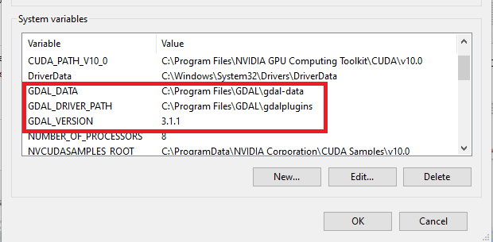
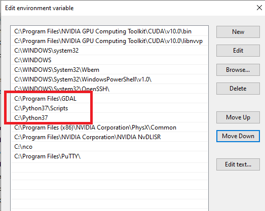

Here is a list of all possible error you can encounter. If you encounter a new error, please report an issue in the repository and I will include that too. Afterall, it is always the community that makes open-source efforts possible. 

### 1. ModuleNotFoundError: No module named '_gdal'  
This error is likely when the paths were somehow not added to the system variables. 
* Open File Explorer, in the left pane, right-click on "This PC" and go to "Properties". 
* In the left pane, click on the "Advanced System Setting", go to the "Advanced" tab on the top. In that, click on "Environment Variables..." 
* Now, in the lower white panel, there should be three variables for GDAL: "GDAL_DATA", "GDAL_DRIVER_PATH" amd "GDAL_VERSION" as shown in the image below. Hoping that your files are installed in the same place and you are using the same GDAL version, you can use the same variables or edit as needed. 
 

* After you are done fixing this, in the variable names, find and click on "Path", click on the "Edit.." button. 
* Check if you have the three paths shown in the image below, if not, go to these directories to check if the files are installed there (just to be sure), and then add the path here. In case you files are not present, this is probably because you did not change the installation directory for Python as I mention in the blog and the video. Follow that and it should work just fine. 
 
